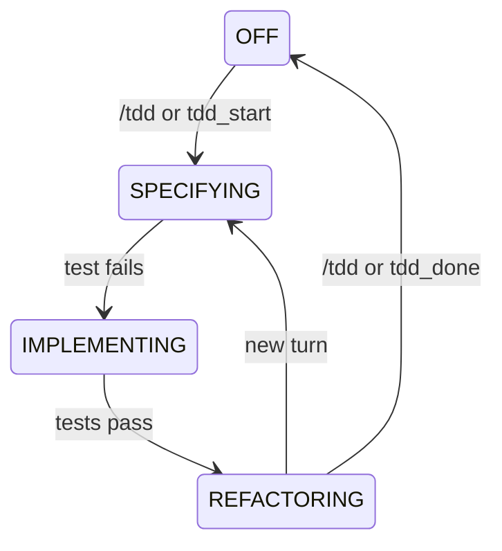

# pi-tdd

pi-tdd is a TDD extension for [Pi](https://pi.dev), the terminal coding agent. It guides Pi to use TDD for new features, bug fixes, and changes to business logic, and enforces a **red-green-refactor** cycle. It includes built-in parsing for popular test frameworks across the major languages, and can infer a sensible default when a project does not already have a test setup.

[](https://github.com/kreek/pi-tdd/releases/download/v1.0.0/demo.mp4)

---

**Table of contents**

- [Quick start](#quick-start)
- [What is TDD?](#what-is-tdd)
- [Why this matters for coding agents](#why-this-matters-for-coding-agents)
- [How it works](#how-it-works)
- [Phase details](#phase-details)
- [Test command inference](#test-command-inference)
- [Test file detection](#test-file-detection)
- [Test output parsing](#test-output-parsing)
- [HUD widget](#hud-widget)
- [Eval](#eval)
- [Limits](#limits)
- [License](#license)

---

## Quick start

### 1. Install Pi

```bash
npm install -g @mariozechner/pi-coding-agent
```

Launch Pi and authenticate:

```bash
pi
```

### 2. Install pi-tdd

**From Git:**

```bash
# Project-local
pi install -l git:git@github.com:kreek/pi-tdd.git

# Global
pi install git:git@github.com:kreek/pi-tdd.git
```

**From a local checkout:**

```bash
git clone git@github.com:kreek/pi-tdd.git
cd pi-tdd

# Project-local
pi install -l ./

# Global
pi install ./
```

For manual global development installs, `npm run install-ext` symlinks the current checkout into `~/.pi/agent/extensions/pi-tdd`.

If Pi is already running, run `/reload` inside the session to pick up the extension.

### 3. Use it

Just ask the agent to work on a new feature, fix a bug, or change business logic. The extension nudges the agent to call `tdd_start` automatically when the intended behavior should be made explicit in tests before changing implementation:

```
Fix the off-by-one error in pagination
```

The agent enables TDD, writes or updates a test, implements the change, refactors, and calls `tdd_done` when finished.

You can also toggle TDD manually with the slash command:

```
/tdd
```

## What is TDD?

[Test-driven development](https://en.wikipedia.org/wiki/Test-driven_development) is a disciplined workflow that produces code proven to work and safe to change:

1. Write a test that expresses the next behavior you want.
2. Run it and confirm it fails.
3. Write the smallest correct code that makes it pass.
4. Refactor as necessary without changing behavior.
5. Repeat.

The test does not have to be a unit test. Use the cheapest test that can prove the behavior.

## Why this matters for coding agents

Research shows that human-written acceptance criteria improve agent code generation accuracy by 12-46 percentage points ([TDFlow](https://arxiv.org/abs/2510.23761), 2025). Context matters: you can hand an agent a requirements doc and let it figure things out, but results are better when a human specifies the behavior they want. When a human gets the user story and acceptance criteria right, pi-tdd's red-green-refactor cycle converts that guidance into tests that keep the agent on track.

Separately, test-based iterative workflows improve agent accuracy even when the agent writes its own tests. [AlphaCodium](https://arxiv.org/abs/2401.08500) (2024) found that a test-execute-fix loop improved GPT-4 accuracy from 19% to 44% on competitive programming tasks. [Reflexion](https://arxiv.org/abs/2303.11366) (NeurIPS 2023) hit 91% on HumanEval using self-generated tests, up from 80%. The consistent finding: test execution gives agents external grounding that pure generation cannot.

Tests also serve as context. Agents work from what they're given and solve for it. An existing test suite shows the agent how the application actually works, the same way an experienced engineer reads the tests first to understand a codebase. Tests catch when the agent breaks functionality elsewhere while solving for its immediate task. And for humans, tests are living documentation that outlasts any ticket/issue description.

Without test-driven discipline, coding agents tend to:

- Implement before specifying behavior.
- Change too much at once.
- Mix feature work with refactors.
- Declare success from plausibility instead of proof.

`pi-tdd` makes that discipline operational by telling the agent which kind of work is allowed right now, blocking out-of-phase tool calls, treating test output as the transition signal between phases, and keeping the cycle visible through the HUD.

The result is smaller diffs, better reviewability, and fewer ungrounded changes.

## How it works

The extension provides two agent tools and a manual toggle:

| Interface | Description |
|-----------|-------------|
| `tdd_start` | Agent tool: enables TDD mode |
| `tdd_done` | Agent tool: disables TDD mode when work is complete |
| `/tdd` | Slash command: manual toggle for user override |

When TDD is off, the extension injects a system prompt nudge telling the agent that TDD is available for new features, bug fixes, and changes to business logic. The agent decides whether the current task warrants it. No keyword heuristics.

When TDD is active, the extension:

1. **Injects phase-specific instructions** into the agent's system prompt, telling it what kind of work is allowed.
2. **Blocks production code writes in SPECIFYING** -- only test files and config files can be written until a test exists and fails.
3. **Auto-runs tests after file writes** and uses the results to advance phases.
4. **Detects manual test runs** via bash and uses those results for phase transitions too.
5. **Displays a HUD widget** showing the current phase, cycle count, and test results.

Phase transitions are automatic and driven entirely by test results:



## Phase details

### SPECIFYING

You provide a well-written user story with clear acceptance criteria. The agent writes a focused, failing test that captures the behavior you described. Better tests lead to better code. This is where your guidance has the most leverage: the more precisely you describe the behavior, the tighter the feedback loop that follows.

pi-tdd blocks `write` and `edit` tool calls targeting production code. Only test files and config files are allowed through. Once a test file has been written and the test command reports failure, pi-tdd advances to IMPLEMENTING.

### IMPLEMENTING

The agent writes the minimal production code to make the failing test pass. pi-tdd runs tests after every file write. Once the test command reports success, pi-tdd advances to REFACTORING.

### REFACTORING

The agent restructures code freely. pi-tdd runs tests after every change. If tests fail, the agent is told to revert. No new behavior should be introduced in this phase.

pi-tdd advances back to SPECIFYING automatically when you start a new turn, beginning the next cycle.

### Non-TDD tasks

Some file changes have no testable behavior: config files, lockfiles, dotfiles, manifests. pi-tdd recognizes these by path pattern and lets them through in any phase without triggering test runs.

## Test integration

pi-tdd infers the test command, detects test files, and parses test output automatically. No configuration needed for most projects.

**Command inference** looks for project files and picks the right runner:

| Detected file | Test command |
|--------------|-------------|
| `package.json` with a `test` script | `npm test` |
| `Cargo.toml` | `cargo test` |
| `go.mod` | `go test ./...` |
| `pytest.ini` or `pyproject.toml` | `pytest` |

If inference fails, the extension prompts for a test command on first `/tdd` invocation.

**File detection** is convention-based. Files matching `*.test.*`, `*.spec.*`, `*_test.*`, `*_spec.*`, or files under `__tests__/` or `test/` directories are treated as test files.

**Output parsing** covers the major framework and runner formats across the languages below. Some parsers intentionally cover multiple tools that emit the same output shape.

| Language | Frameworks / runners |
|----------|----------------------|
| JS/TS | Jest, Vitest, Mocha, Bun, AVA |
| Python | pytest, unittest |
| Go | go test |
| Rust | cargo test |
| Ruby | RSpec, Minitest |
| Java/Kotlin | Gradle; JUnit/Maven (summary fallback) |
| C# | dotnet test |
| Swift | XCTest, Swift Testing |
| PHP | PHPUnit, Pest |
| Elixir | ExUnit |
| Universal | TAP |

When individual test lines aren't found, the parser falls back to summary-level regex matching. Frameworks like JUnit/Maven that only output summaries are handled by this fallback. Parsed results are appended to the tool result so the agent sees them inline, and also populate the HUD widget.

## HUD widget

When TDD is active, a widget appears in the Pi interface showing:

- **Phase** (SPECIFYING / IMPLEMENTING / REFACTORING) with color coding
- **Cycle count** (increments each time REFACTORING transitions back to SPECIFYING)
- **Test summary** (passed / failed / duration)
- **Individual test results** (up to 7, with overflow indicator)

The widget updates after every test run.

## Development

```bash
git clone git@github.com:kreek/pi-tdd.git
cd pi-tdd
npm install
npm run install-hooks # enable the repo-local pre-commit hook
npm test          # vitest, 46 tests for the parser module
```

The pre-commit hook runs `npm run lint:staged`, which executes `biome check --staged`.

Project structure:

```
src/
  index.ts        # Extension entry point, phase machine, HUD, tools
  parsers.ts      # Test output parsers (Strategy pattern, 13 frameworks)
test/
  parsers.test.ts # Parser test suite
```

To add a new test framework parser, append a `TestLineParser` object to the `defaultParsers` array in `src/parsers.ts`.

## Limits

This extension improves discipline. It does not replace judgment.

- pi-tdd enforces the loop, not the quality of the tests. If the user story/AC are shallow, brittle, or wrong, passing them only gives shallow, brittle, or wrong confidence.
- The gate only blocks writes in SPECIFYING. IMPLEMENTING and REFACTORING steer via the system prompt rather than blocking tool calls, because over-blocking disrupts natural agent flow.
- No persistent state between sessions.
- No LLM-backed reviews -- the extension trusts test results as the source of truth.

The goal is not perfect enforcement. The goal is to keep the agent inside a tight feedback loop where tests drive every change.

## Eval

pi-tdd includes an eval harness built on [pi-do-eval](https://github.com/kreek/pi-do-eval), a general-purpose eval framework for Pi extensions. The eval runs Pi with pi-tdd loaded against small coding projects, then scores TDD compliance, test quality, and correctness.

Setup:

```bash
cd eval
npm install
```

List the available trials, variants, and suites:

```bash
npm run eval -- list
```

Run one project directly:

```bash
npm run eval -- run --trial temp-api --variant typescript-vitest
```

Run the routine regression suite:

```bash
npm run eval -- run small
```

`small` is the fast smoke/regression suite for day-to-day changes. `full` is the broader suite for larger changes and release confidence.

Suites run serially by default. You can opt into parallel suite execution with `--concurrency <n>`, but the harness refuses values above `1` when the active worker or judge provider is subscription-backed (`anthropic` OAuth, `github-copilot`, `google-gemini-cli`, `google-antigravity`, or `openai-codex`).

Open the web viewer:

```bash
npm run view
```

Then visit `http://localhost:3333`. The viewer reads run artifacts from `eval/runs/`, including the top-level `eval/runs/index.json` generated after each run.

Check whether the latest suite regressed against the previous completed run of that suite:

```bash
npm run eval -- regress small
```

By default, `regress` compares the latest completed suite run against the immediately previous completed run of the same suite and exits nonzero if it detects a regression. You can also compare against a specific suite run ID with `--against <suite-run-id>` or tune the score threshold with `--threshold <n>`.

## License

MIT
